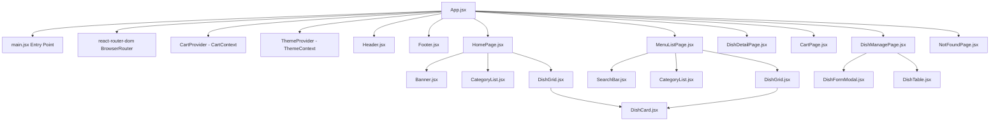

# Component Tree - TastyHub Restaurant Manager

This document visualizes the component hierarchy of the TastyHub Restaurant Manager React application.

## Component Hierarchy Diagram (Mermaid)

## Component Types

### 1. Root / Configuration
- `main.jsx`: Application bootstrap.
- `App.jsx`: Global route definitions, state orchestration, and layout wrapper.

### 2. Context / State Managers
- `CartContext.jsx`: Manages global shopping cart state (items, quantity updates, total count).
- `ThemeContext.jsx`: Toggles dark/light mode and synchronizes with localStorage.

### 3. Page Components (Containers)
- `HomePage.jsx`: Displays banner, categories, and featured dishes list.
- `MenuListPage.jsx`: Displays searching, filters, lists, and paginated dishes.
- `DishDetailPage.jsx`: Full ingredients and availability detail view of a single dish.
- `CartPage.jsx`: Table layout displaying all cart items, pricing summaries, and order placement.
- `DishManagePage.jsx`: Admin dashboard listing database entries with edit/add/delete forms.

### 4. Shared / Reusable UI Components
- `Header.jsx`: Top navigation menu bar. Responsive mobile collapse toggle.
- `Footer.jsx`: Bottom footer with copyright and project metadata.
- `DishCard.jsx`: Reusable dish display tile. Handles layout variants.
- `SearchBar.jsx`: Input component with typing event handlers and field validators.
